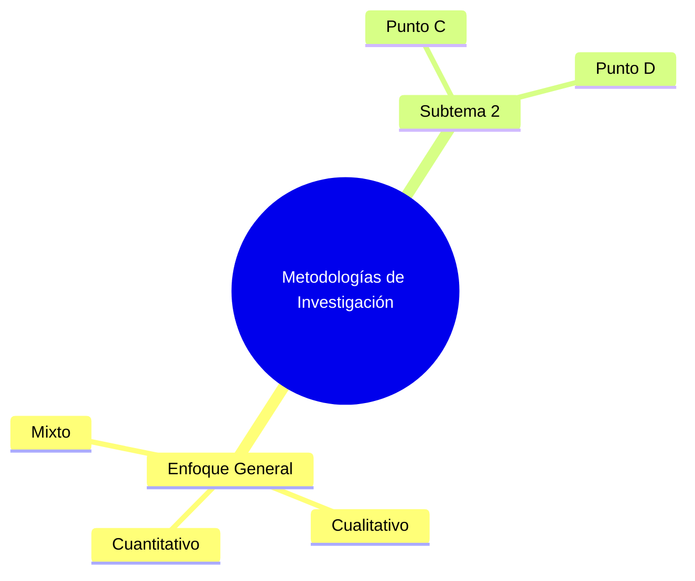
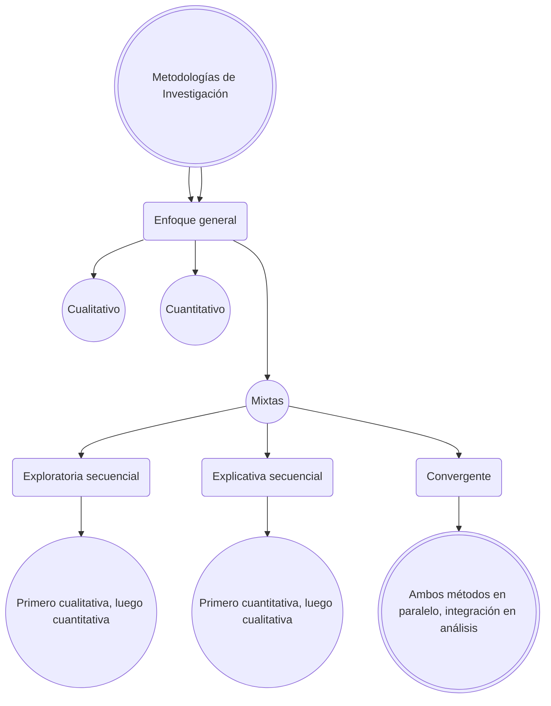

## **Concepto**
El enfoque en la investigación es el marco filosófico, teórico o conceptual que guía cómo se aborda un estudio. Define la perspectiva desde la cual se interpreta la realidad, se plantean las preguntas y se seleccionan los métodos. Es la "visión" que sustenta todo el proceso de investigación y determina cómo se relaciona el investigador con el objeto de estudio.

El enfoque dentro de la investigación busca determinar cómo se abordará el problema de estudio y qué tipo de datos se utilizarán para responder las preguntas de investigación. Esencialmente, define la perspectiva desde la cual se interpretará la realidad y el camino metodológico que guiará todo el proceso investigativo.

## **¿Qué establece el enfoque?**

**La naturaleza del problema**

-   ¿Se busca medir variables objetivamente ? _**(cuantitativo)**_.
-   ¿O se pretende comprender significados, experiencias o contextos subjetivos _**(cualitativo)**_.

**El tipo de datos**

-   Datos numéricos y estadísticos _**(cuantitativo)**_.
-   Datos narrativos, descriptivos o interpretativos _**(cualitativo)**_.

**El método de análisis :**
-   Análisis estadístico (cuantitativo).
-   Interpretación de patrones, temas o narrativas (cualitativo).

**La relación con el objeto de estudio**
-   Enfoque objetivo (distancia entre investigador y fenómeno).
-   Enfoque subjetivo (interacción cercana entre investigador y fenómeno).

???+ note "¿Qué comprende el enfoque?"
    ???+ info "1.   Paradigma filosófico"
        Define cómo se entiende el conocimiento (epistemología), la realidad (ontología) y los valores (axiología).

        -   Positivismo
        -   Constructivismo
        -   Enfoque crítico.

    ???+ info "2.  Estrategia metodológica "

        Indica si el estudio será

        -   Cualitativo
        -   Cuantitativo 
        -   Mixto , y cómo se adaptan a los objetivos.

    ???+ info "3.   Perspectiva teórica"

    Las teorías o conceptos que sustentan la investigación (ej.: teoría de género, teoría del caos).
  
=== "Enfoque general"
     Es el marco teórico y práctico que guía la investigación _(ej.: enfoque cualitativo, cuantitativo o mixto)._
     
    === "Metodologías Cualitativas"
        Se centran en comprender significados, experiencias y perspectivas subjetivas.

        ???+ info "Etnografía"
              Estudia grupos culturales o comunidades en su entorno natural.
           
        ???+ info "Estudio de caso" 
              Análisis profundo de un individuo, grupo, organización o evento.
            
        ???+ info "Fenomenología"
              Explora la esencia de experiencias vividas por personas.
            
        ???+ info "Teoría fundamentada (Grounded Theory)"
               Genera teorías a partir de datos recopilados.
            
        ???+ info "Investigación narrativa "
               Analiza historias o relatos personales.

        ???+ info "Investigación acción participativa"
               Busca transformar realidades sociales con la participación de los involucrados.

    === "Metodologías Cuantitativas"

        Se basan en datos numéricos y análisis estadístico para probar hipótesis.

        **Experimental :** Manipula variables para establecer relaciones causa-efecto (ej.: ensayos controlados).

        **Cuasiexperimental :** Estudia causas sin asignación aleatoria (ej.: estudios con grupos intactos).
        
        **Correlacional :** Mide la relación entre variables sin manipulación.

        **Descriptiva :** Describe características de una población o fenómeno (ej.: encuestas).
        
        **Longitudinal :** Analiza cambios a lo largo del tiempo (ej.: seguimiento de cohortes).
        
        **Transversal :** Recoge datos en un solo momento (ej.: estudios epidemiológicos).
              
    === "Metodologías Mixtas (Mixtas Methods)"

        Combinan enfoques cualitativos y cuantitativos:

        Exploratoria secuencial : Primero cualitativa, luego cuantitativa.
        
        Explicativa secuencial : Primero cuantitativa, luego cualitativa.
        
        Convergente : Ambos métodos se usan en paralelo y se integran en el análisis.

<!--             
            4. Otras Metodologías Específicas
            Investigación acción : Busca resolver problemas prácticos con participación activa de los actores.
            Estudio longitudinal : Sigue a sujetos durante un período prolongado.
            Metaanálisis : Sintetiza resultados de múltiples estudios cuantitativos.
            Revisión sistemática : Evalúa y resume evidencia existente sobre un tema.
            Investigación histórica : Analiza eventos pasados mediante fuentes primarias/secundarias.
            Delphi : Consenso de expertos mediante rondas de consultas anónimas.

=== "Procedimientos específicos"
        Incluye técnicas como encuestas, entrevistas, experimentos, observación, etc.
=== "Justificación"
        Explica por qué se eligieron ciertos métodos y cómo se adaptan a los objetivos del estudio.

## Elección de la Metodología
Depende de:

Objetivos de la investigación.
Pregunta de estudio (exploratoria, descriptiva, explicativa).
Recursos disponibles (tiempo, financiamiento, acceso a datos).
Paradigma filosófico (positivismo, constructivismo, crítico). -->

 

